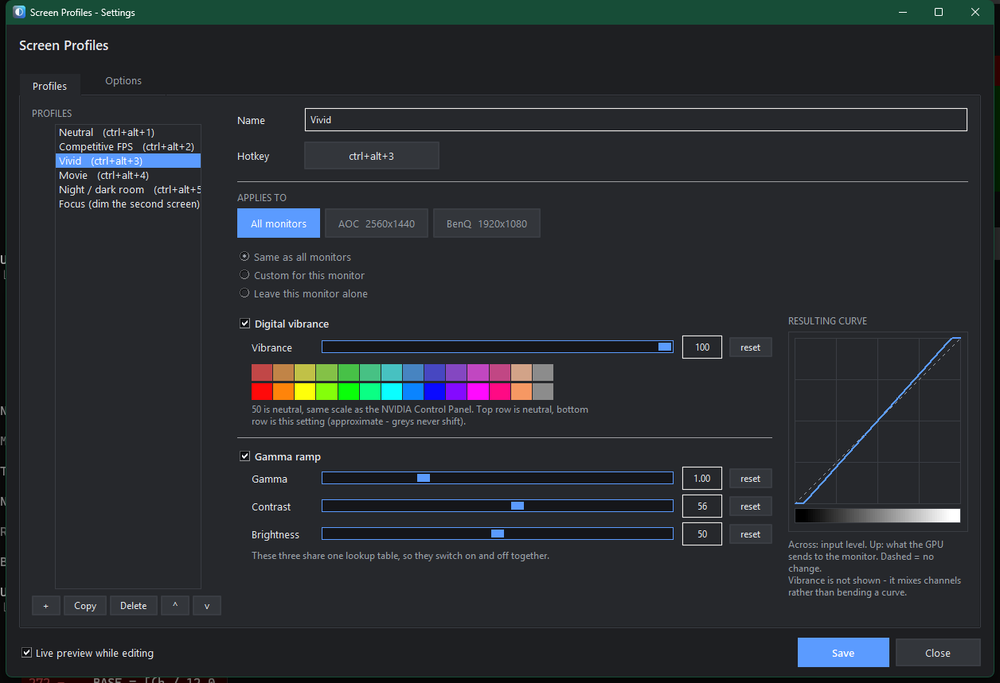
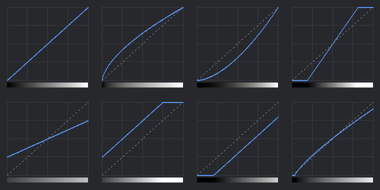

# ScreenTuner

**Hotkey-switchable display profiles for Windows: NVIDIA digital vibrance, plus
gamma, contrast and brightness on any GPU. Per-monitor, with live preview.**

The NVIDIA Control Panel's display sliders, except you can flip between named profiles
instantly — mid-game, without alt-tabbing. Per-monitor, with a live-preview settings
window and a watchdog that puts your profile back when a fullscreen game steals it.

No dependencies, no runtime to install, no telemetry, no network access.

If you came here looking for a *vibranceGUI alternative*: this does the same
digital-vibrance job, and adds gamma/contrast/brightness (which work on any GPU),
per-monitor profiles, and a settings window.



---

## Install

**Installer (recommended)** — grab `ScreenTuner-x.y.z-setup.exe` from
[Releases](https://github.com/NachoSC/ScreenTuner/releases). Per-user, so there's no
admin prompt.

**winget**

```powershell
winget install NachoSC.ScreenTuner
```

**Portable** — download `ScreenTuner-x.y.z-portable.zip`, unzip anywhere, run
`ScreenTuner.exe`. It creates `profiles.json` beside itself. To register it properly
later (Start Menu entry, Installed-apps entry, run at login):

```powershell
.\ScreenTuner.exe --install      # and --uninstall to remove every trace
```

### About the SmartScreen warning

ScreenTuner is not code-signed, so Windows will show **"Windows protected your PC"** on
first run. Click **More info → Run anyway**.

This is not a judgement about the software — it means nobody has paid for a certificate.
An OV code-signing certificate costs a few hundred dollars a year and now requires a
hardware token, which is hard to justify for a free, donation-funded tool. If that
bothers you, the source is right here and `build.bat` reproduces the binary.

---

## Using it

It lives in the system tray. **Left-click** the icon for settings, **right-click** for
the menu. Neither changes your screen on its own — switching profiles is the hotkeys'
job, or picking one from the menu.

| Hotkey | Action |
| --- | --- |
| `Ctrl+Shift+1` … `Ctrl+Shift+6` | Apply profile 1–6 |
| `Ctrl+Shift+0` | Back to driver defaults |
| `Ctrl+Shift+V` | Cycle to the next profile |
| `Ctrl+Shift+=` / `Ctrl+Shift+-` | Nudge vibrance ±5 |
| `Ctrl+Shift+F5` | Reload `profiles.json` |
| `Ctrl+Shift+Q` | Quit |

Pressing an active profile's own hotkey again returns to neutral, so every profile
doubles as an on/off toggle. All bindings are editable.

If a combination is already taken by another app, ScreenTuner says so in its log rather
than failing silently.

## Settings window

Everything in `profiles.json` is editable there, so you never have to touch JSON.

- **Live preview** — sliders apply to your actual screen as you drag. Close without
  saving and your display goes back exactly as it was.
- **Applies to** — edit *All monitors*, or pick one screen and choose *Same as all* /
  *Custom for this monitor* / *Leave this monitor alone*.
- **Hotkey capture** — click the button, press the combination. It warns on conflicts.
- **Resulting curve** — drawn from the same lookup table that gets written to the driver,
  so it's the real transfer curve rather than an illustration.
- **Colour palette** under the vibrance slider: top row neutral, bottom row at the
  current setting.

Saving writes `profiles.json` and tells the running app to reload — no restart.

## Profiles

```json
{
  "name": "Competitive FPS",
  "hotkey": "ctrl+alt+2",
  "vibrance": 80,
  "gamma": 1.10,
  "contrast": 55,
  "brightness": 54
}
```

| Field | Range | Neutral | Notes |
| --- | --- | --- | --- |
| `vibrance` | 0–100 | 50 | Same scale as the Control Panel's Digital Vibrance. NVIDIA only |
| `gamma` | 0.30–2.80 | 1.00 | Also accepts `[r, g, b]` |
| `contrast` | 0–100 | 50 | Also accepts `[r, g, b]` |
| `brightness` | 0–100 | 50 | Also accepts `[r, g, b]` |

Omit a field to leave that knob alone. One caveat: gamma, contrast and brightness share a
single hardware lookup table, so setting any one writes all three — the omitted ones fall
back to neutral. Vibrance is independent.

### Per-monitor

Top-level values are the defaults; `monitors` overrides individual screens, so **one
hotkey can drive two monitors differently**:

```json
{
  "name": "Focus",
  "hotkey": "ctrl+alt+6",
  "vibrance": 55,
  "monitors": {
    "secondary": { "vibrance": 42, "brightness": 38 }
  }
}
```

`{ "skip": true }` leaves a monitor untouched. Monitors match by vendor (`"Dell"`,
`"LG"`), position (`"primary"`, `"secondary"`), index, EDID id, or adapter name.
Prefer the first two — Windows renumbers adapter names over time.

Run `ScreenTuner.exe --list` to see every monitor with all of its usable keys, plus each
profile expanded per screen.

## Fullscreen games

**Digital vibrance works in exclusive fullscreen.** It's applied by the driver downstream
of what the game renders, so the game can't overwrite it.

**Gamma, contrast and brightness are contested.** In exclusive fullscreen the game owns
the gamma ramp, and any title with its own brightness slider will overwrite yours —
usually visible the moment you alt-tab.

So ScreenTuner watches for it. It re-checks every 2 seconds, and within ~0.6 s of any
alt-tab, and puts your profile back when something has taken it. It never fights the
settings window: enforcement pauses while that's open.

```jsonc
"enforce_profile": true,      // set false to leave the fight alone
"enforce_interval_ms": 2000
```

Borderless windowed avoids the conflict entirely. HDR does not — a monitor with HDR
enabled ignores gamma ramps altogether, though vibrance still works.

## Requirements

| | |
| --- | --- |
| Windows 10/11, 64-bit | Required. It's Win32 throughout |
| Any GPU | Gamma, contrast, brightness — AMD, Intel, NVIDIA |
| NVIDIA GPU + driver | **Digital vibrance only.** Without it the app runs normally, logs `vibrance disabled`, and everything else still works |

On hybrid-graphics laptops, a panel wired to the integrated GPU won't get vibrance,
because NVAPI doesn't enumerate it. Gamma still applies.

### Roadmap

**AMD and Intel saturation is planned**, which also fixes hybrid-graphics laptops whose
built-in panel is wired to the integrated GPU. So are **profiles that follow the running
program** — launch Tarkov, get your Tarkov profile, without touching a hotkey.

See [ROADMAP.md](ROADMAP.md). If you have AMD or Intel hardware and want to help test,
please open an issue: the main obstacle is not having the hardware to develop against.

## How it works

- **Digital vibrance** → `NvAPI_SetDVCLevelEx`, resolved at runtime through
  `nvapi_QueryInterface`. A gamma ramp genuinely cannot do this: a ramp is a per-channel
  curve, and saturation requires mixing channels.
- **Gamma / contrast / brightness** → `SetDeviceGammaRamp`, a 256-entry RGB lookup table
  per monitor. Contrast scales around the midpoint, brightness offsets, then gamma is
  applied as `v ** (1/g)`.

All three fold into that one curve, because the hardware has exactly one lookup table per
channel. Each control bends it differently:



*Neutral · gamma 1.60 · gamma 0.60 · contrast 80 — then contrast 25 · brightness 75 ·
brightness 30 · a combined profile. Gamma bows the curve, contrast pivots it around the
midpoint, brightness slides it — note where the ends clip.*

The original ramps and vibrance levels are captured at startup and restored on exit,
including per-monitor differences.

**It does not** inject into games, hook APIs, read game memory, or touch the network. It
calls display APIs, the same ones the NVIDIA Control Panel uses. Anti-cheat has no reason
to care.

### Gotchas

- **Windows clamps extreme gamma ramps.** If an aggressive profile looks weaker than
  expected, run `ScreenTuner.exe --enable-full-gamma-range` from an **admin** terminal
  and reboot.
- **HDR ignores gamma ramps** entirely. Vibrance still works.
- The tray icon starts in the `^` overflow, where Windows 11 puts new icons. There's a
  **Pin icon to taskbar** toggle in the tray menu.
- **AltGr is Ctrl+Alt as far as Windows is concerned.** On layouts that use AltGr to
  type characters — Spanish, German, most non-US layouts — a `Ctrl+Alt+…` binding fires
  while you are simply typing. On a Spanish layout `AltGr+2` types `@`, which would
  otherwise trigger `Ctrl+Alt+2`.

  Defaults are therefore `Ctrl+Shift+…`, which has no such clash anywhere. If you do bind
  something to `Ctrl+Alt`, ScreenTuner detects whether your layout has AltGr and ignores
  the hotkey when the key actually held is the right Alt — that is AltGr rather than a
  genuine Ctrl+Alt chord. It also warns you at startup and in the settings window.

## Command line

```
ScreenTuner.exe                     tray + hotkeys
ScreenTuner.exe --gui               settings window
ScreenTuner.exe --list              monitors, current vibrance, resolved profiles
ScreenTuner.exe --apply "Movie"     apply once and exit
ScreenTuner.exe --reset             back to neutral
ScreenTuner.exe --install [DIR]     install, with Start Menu and Installed-apps entries
ScreenTuner.exe --uninstall         remove everything it registered
ScreenTuner.exe --startup on        run at login (on/off/toggle/status)
ScreenTuner.exe --pin-tray          pin the tray icon to the taskbar
ScreenTuner.exe --diagnostics       scrubbed report for a bug report
```

Run from a terminal, output goes to that terminal.

## Reporting a bug

Right-click the tray icon → **Copy diagnostics for a bug report**, and paste it into the
issue. From a terminal, `ScreenTuner.exe --diagnostics` prints the same thing and writes
`screentuner-diagnostics.txt` beside the exe.

It includes your Windows version, GPU, monitors, resolutions, current vibrance levels and
settings, plus the last 40 log lines. It deliberately **excludes** your username, home
folder, machine name and the contents of your profiles — profile *names* only, since
people put all sorts in those. Any path that does appear is reduced to `%LOCALAPPDATA%`
form.

The app also keeps a rolling `screentuner.log` next to the executable, which is where
startup problems show up if the tray icon never appears.

## Building

Needs Python 3.10+ on Windows. Nothing else — the app is pure `ctypes`.

```
build.bat              -> dist\ScreenTuner\        the app
build-installer.bat    -> dist\installer\          the setup wizard (needs Inno Setup 6)
```

`build.bat` creates a throwaway venv in `.build\` and installs PyInstaller there, leaving
your global Python alone. The build is `--onedir` deliberately: `--onefile` unpacks 25 MB
into `%TEMP%` on every launch, which costs ~0.5 s of startup, trips antivirus heuristics,
and leaves the folder behind whenever the process is killed rather than closed.

## Tests

```
tests
un.bat unit      pure logic - any Windows machine, no GPU or build needed
tests
un.bat system    real displays, real hotkeys, real install/uninstall
```

The split is by what a machine can answer rather than by test size, so someone without an
NVIDIA card can still check profile resolution, hotkey parsing and the gamma maths.
Details in [tests/README.md](tests/README.md).

## Contributing

Pull requests welcome — please read [CONTRIBUTING.md](CONTRIBUTING.md) first, especially
the contributor terms, which exist so the project can keep its licence coherent.

## Licence

[PolyForm Noncommercial License 1.0.0](LICENSE.md). Free for any noncommercial use —
personal, hobby, educational, charitable. Commercial rights are reserved to the
maintainer. This is source-available, not OSI open source, and that's deliberate.

Third-party components are listed in [THIRD-PARTY-NOTICES.md](THIRD-PARTY-NOTICES.md).
Nothing NVIDIA-owned is bundled or redistributed: the app calls the driver you already
have. NVIDIA and GeForce are trademarks of NVIDIA Corporation; this project is not
affiliated with or endorsed by them.
